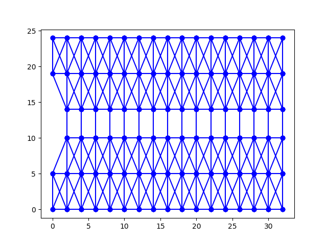

# Python Graph Bridge Generator

Generate and visualize graphs that closely represent real steel-truss bridge structures. 
The code can be used to generate an arbitrary large dataset of bridge-graphs of desired size for graph theory projects.



## Getting started

### Dependencies

* [Python3](https://www.python.org/downloads/) Versions of Python below v3 might work but I cannot guarantee flawless execution.
* [MatPlotLib](https://matplotlib.org/stable/users/installing.html) For visuals
* [Numpy](https://numpy.org/install/) For vectors
```
python -m pip install -U pip
python -m pip install -U matplotlib numpy
```

### Running the code

From within the project directory:
- [NUM_VERTICES]: is the number of vertices in the graph. Must be greater than 18.
- [DENSITY]: how dense the bridge is. Must be some value between 0-1.
- [IS_WINDY]: (true/false) if graph should have windy edge costs.
- [IS_BRIDGE]: (true/false) if graph should represent a bridge.
- [OUTPUT_FILE]: the string name of a file path including the desired filename.

```
python graph_generator.py [NUM_VERTICES] [DENSITY] [IS_WINDY] [IS_BRIDGE] [OUTPUT_FILE]
```

Example
```
python graph_generator.py 20 0.1 true true bridge.csv
```


## Meta

Created for University of Nevada, Reno's [Evolutionary Computing Systems Lab (ECSL)](https://ecsl.cse.unr.edu/), as part of an [bridge inspection simulation and optimization project](https://ecsl.cse.unr.edu/projects/bridge_inspection/index.html). 
Forked repository originally created by [Nicholas Harris](https://github.com/nicholasharris/Graph-and-Bridge-Generator).
